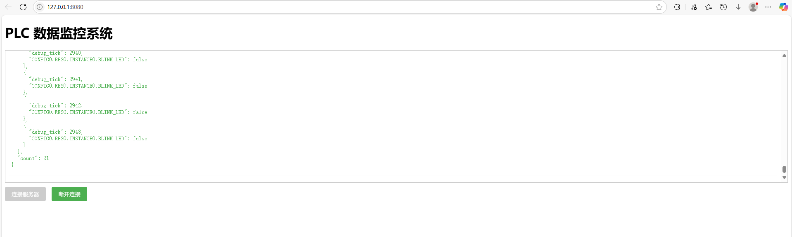

# PLCEmulator

基于 OpenPLC 修改的 PLC 程序仿真器，在 JS 中调用 Python 程序，可实现 B/C 架构

1. 仿真器运行方法：

    node editor/test.js

    然后输入相应的操作，包括 run, build, stop, subscribe, unsubscribe, force, release

    也可以修改 Laucher.py 入口函数，使用 python editor/Laucher.py <project_path> 的方式运行，方便调试

2. 测试客户端运行方法：

    http-server -p 8080

    浏览器地址： http://localhost:8080

    

3. 文件结构：

    仿真器：emulator

    测试客户端：client

    测试 PLC 程序：Blink
